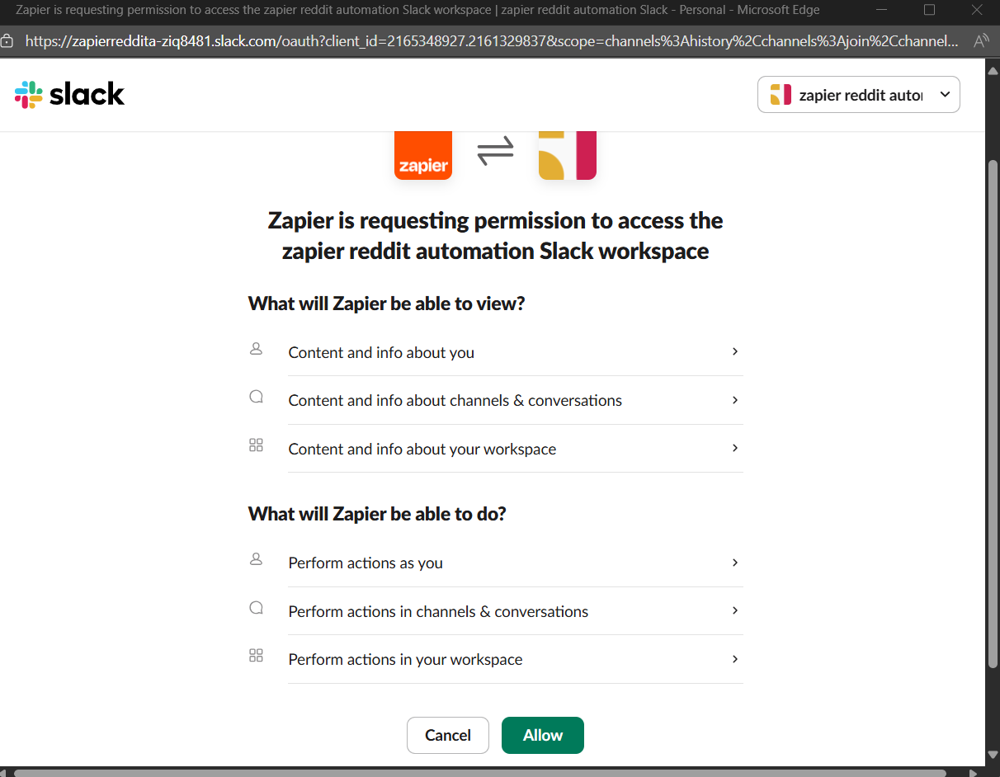

# 🚀 GTM Automation Workflow (Zapier + AI)

## 📌 Project Overview
This Zapier workflow automates **Go-To-Market (GTM) opportunity detection** from Reddit.  
It monitors Reddit for growth-related discussions, classifies them with AI, generates engagement suggestions, and logs the results into Google Sheets. High-priority opportunities also trigger Slack alerts.  

This helps growth teams **track, score, and engage with potential customers** in online communities like Reddit.

---

## ⚙️ Workflow Steps
1. **Trigger: Reddit Search**
   - Monitors Reddit for posts matching keywords (`customer churn`, `retention marketing`, `Shopify growth`).
   - Captures post details (title, content, subreddit, author, link, timestamp).

2. **AI Classification (OpenAI)**
   - Determines whether the post is business-relevant.
   - Outputs structured JSON:
     - `relevant`
     - `intent`
     - `confidence_score`
     - `reasoning`
     - `business_pain_point`

3. **AI Engagement Suggestion**
   - Summarizes the post.
   - Generates engagement type, suggested message, reasoning, urgency, and follow-up opportunity.

4. **Filter**
   - Only continues if `relevant = true`.

5. **Google Sheets: Create Row**
   - Logs results in a Google Sheet with headers:
     - `Post Link`
     - `Post Title`
     - `Subreddit`
     - `Author`
     - `Post Summary`
     - `Relevance`
     - `Intent`
     - `Confidence Score`
     - `Business Pain Point`
     - `Engagement Type`
     - `Engagement Message`
     - `Engagement Reasoning`
     - `Urgency Level`
     - `Follow-up Opportunity`

6. **Slack Alert (Optional)**
   - Sends formatted alerts for posts with `confidence_score > 0.8`.

---

## 📋 Prerequisites
- Zapier account (Free or Paid)
- Reddit account (for API connection)
- Google Sheets account (with a Sheet prepared using the headers above)
- Slack workspace (optional, for alerts)

---

## ▶️ How to Use This Zap
1. Open the **Zapier shared link** (provided separately).
2. **Build the Zap** into your own Zapier account.
- Press on build it (it will take some time to generate)
 

3. **Connect your accounts**:
   - Reddit → authenticate Reddit account.
   
   
   
   
   
   
   
   
   
   
   
   
   
   
   - Google Sheets → connect your Google Drive/Sheets.
   
   
   
   
   
   
   - Slack → connect your Slack workspace (optional).
   
   
   
   
   
   
   Copy the message from the text file to the input box
   
   
   
4. Run the wrokflow.

---

## 🖼️ Workflow Overview
-   
---

## 📌 Notes
- Only posts classified as `relevant: true` are logged in Sheets.
- Slack alerts are triggered only for posts with `confidence_score > 0.8`.
- The workflow is modular and can be extended to:
  - Monitor LinkedIn (via API or third-party connector).
  - Store data in Airtable instead of Google Sheets.
  - Visualize trends using Data Studio or Looker.

---

## 📂 Deliverables
- This `README.md`
- Zapier shared workflow link
- Google Sheet template with headers
- Text file for slack message
- `/screenshots` folder with images

---
